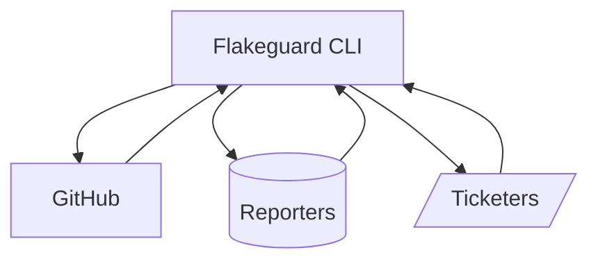
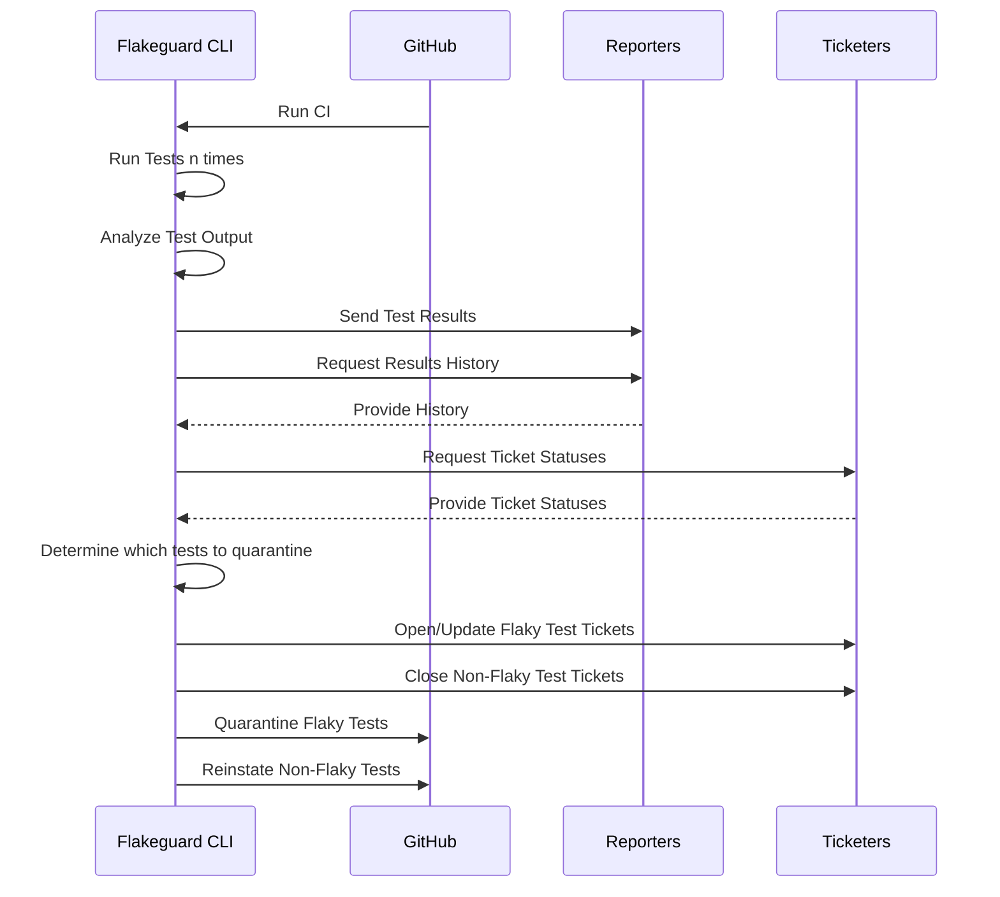
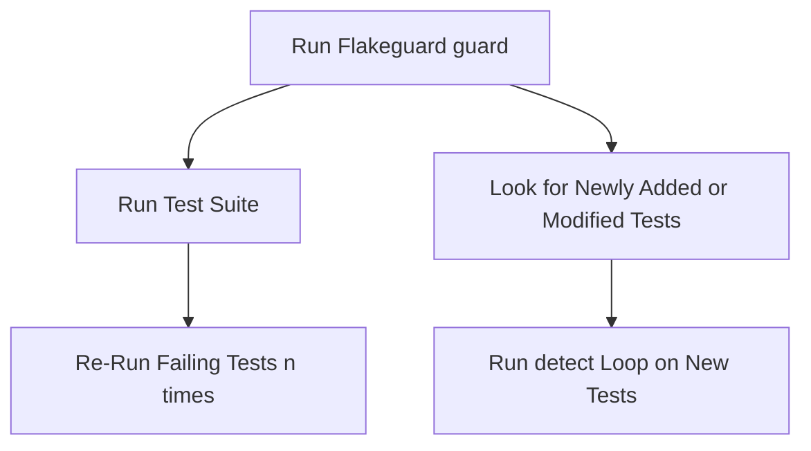

# Flakeguard Design

A high-level design document of how Flakeguard works, and how it interacts with other services. This is a living doc and can change as the scope, plans, and existing structure of Flakeguard changes.

## Flakeguard's Outside Systems

Flakeguard relies on a few different outside systems in order to make it a scalable and stateless tool.

* `GitHub`, the system for git code management and CI/CD. This can expand to other systems later, but for now our only focus is on `GitHub`.
* `Reporters`, systems like [Splunk](https://www.splunk.com/) and [DX](https://getdx.com/), are used to store and retrieve data on the status of your flaky tests (e.g. how flaky has TestX been in the past 7 days).
* `Ticketers`, systems like [Jira](https://jira.atlassian.com/), are used to create tickets that assign work to fix tests identified as flakes. Flakeguard scans for tickets that already exist to add more detail to them, or closed tickets for the same test, so that it can attach context.

## Quarantine and Reinstatement Process

We're considering two approaches, and I believe we can mix-and-match them depending on our needs and what bottlenecks we experience in practice.

### Batch PRs

When running Flakeguard on a cron/dispatch basis, we can make a large PR that quarantines all tests that have hit a certain threshold.

#### Pros

* No merge conflicts to consider.
* Manual intervention to fix a bad or incapable quarantine will be smoother if necessary.
* One team owning these PRs likely leads to higher quality reviews and mitigation overall.

#### Cons

* Slow quarantine resolution (less than 12 hours is probably as fast as it can reasonably get). Longer if the team is understaffed or on vacation.

### Hijack PRs for Flakeguard Commits

Instead of doing a large PR that will likely be the daily chore of a single team to work with, make merging quarantine changes the responsibility of individual developers by adding quarantine commits directly to their PRs.

#### Pros

* Not bottlenecked on a single team to approve the PR.
* Much more immediate quarantine resolution.

#### Cons

* Can run into merge conflicts galore, will probably need some system to deal with these.
* Some tests (like complex subtests) cannot be easily quarantined and may need manual intervention, which can frustrate devs who are unfamiliar with the process. This isn't a big deal, and can be ameliorated with good docs and alerts.

## Guard Mode

A primary goal of Flakeguard is to **guard** your CI from flakes, and guard your main branch from new flakes being introduced. When running in `guard` mode, Flakeguard will detect newly added (and modified) tests and run some `detect` loops on them. If it finds that you're introducing newly flaky tests, it will block your PR.

## Flakeguard's Usage of [gotestsum](https://github.com/gotestyourself/gotestsum)

Flakeguard uses gotestsum to execute tests, and reads the JSON output after execution is complete. To do so, we call out to gotestsum and provide it with args for it and for those to pass on to `go test`. This lets us leverage `gotestsum`'s handy tools for console output and re-running failures.

### Why Not Use `--post-run-command` or `gotestsum tool`?

We might find reason to do this in the future, but for now it's not feasible if we wish to emulate a real test running environment. Especially for the `detect` command, we want to re-run test suites multiple times in a setup that emulates how they would run in a typical flow. If we exclusively use a post-run hook, we lose the ability to do this cleanly. Using `-count=n` doesn't accurately emulate how tests would actually run in a real environment multiple times.
